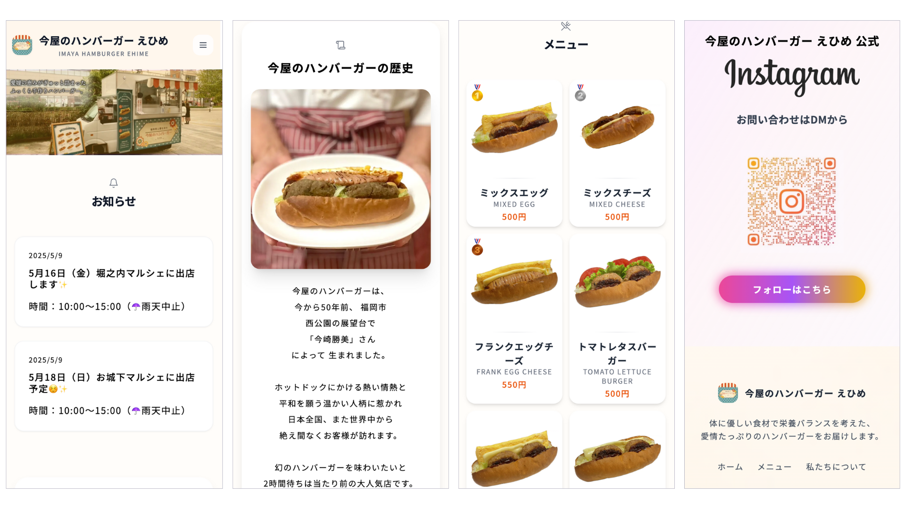

# 今屋のハンバーガー えひめ ・ 公式ウェブサイト

愛媛県松山市を中心に活動するキッチンカー「今屋のハンバーガー えひめ」の公式ウェブサイトです。
体に優しい食材を使用し、愛情を込めて作るハンバーガーを提供する地域密着型のフードトラックです🚚

このウェブサイトは、私が初めて作成したものです。フロントエンドエンジニアの友人から技術的なアドバイスをいただきながら、デザインから実装まで一貫して制作に取り組みました。

## サイトURL

https://www.imaya-ehime.com/

## スクリーンショット

### トップページ

### メニュー

### コンタクト

###　レスポンシブデザイン

## 主な機能

- 出店情報の確認
- メニューの閲覧
- お問い合わせ（Instagram DMへの誘導）
- レスポンシブ対応（スマートフォン・タブレット・PC）

## 使用技術

### フレームワーク・言語

- Next.js(Reactフレームワーク)
- TypeScript

### フロントエンド

- Tailwind CSS
- shadcn/ui(UIコンポーネントライブラリ)

### CMS・バックエンド

- microCMS

### 開発環境

- Node.js
- Yarn(パッケージマネージャー)
- ESLint(コード品質のチェック)
- Prettier(コードフォーマット)

### デプロイ

- Vercel

## Learn More

- [Next.js Documentation](https://nextjs.org/docs)
- [Next.js GitHub repository](https://github.com/vercel/next.js)
