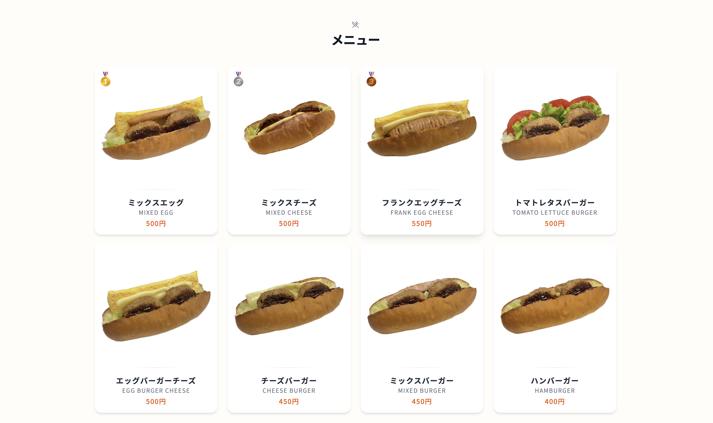
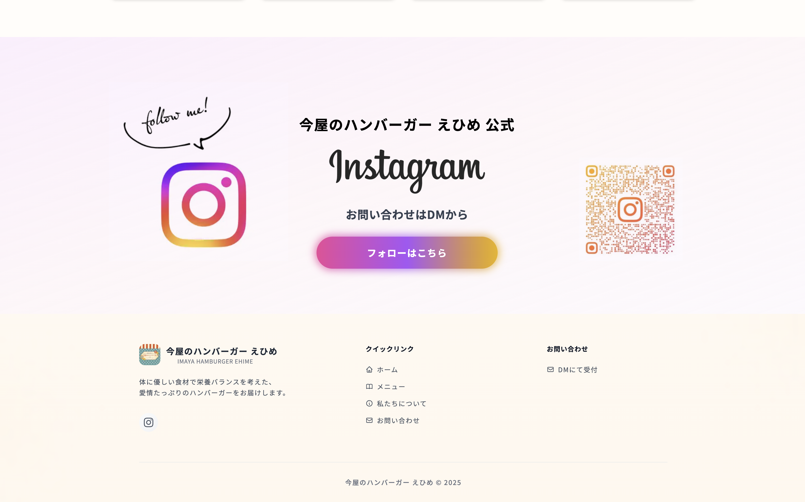

# 今屋のハンバーガー えひめ ・ 公式ウェブサイト

愛媛県松山市を中心に活動するキッチンカー「今屋のハンバーガー えひめ」の公式Webサイトを作成しました。
体に優しい食材と愛情たっぷりのハンバーガーをお届けする、地域密着型のフードトラックです。

このプロジェクトは、私の初めてのWebサイト開発として、フロントエンドエンジニアの友人の技術的なサポートを受けながら、
デザインから実装まで一貫して取り組んだものです。

## サイトURL

https://www.imaya-ehime.com/

## スクリーンショット

### トップページ

### メニュー

### コンタクト

## 主な機能

- 出店情報の確認
- メニューの閲覧
- お問い合わせ（Instagram DMへの誘導）
- レスポンシブ対応（スマートフォン・タブレット・PC）

## 使用技術

### フレームワーク・言語

- Next.js(Reactフレームワーク)
- TypeScript

### フロントエンド

- Tailwind CSS
- shadcn/ui(UIコンポーネントライブラリ)

### CMS・バックエンド

- microCMS

### 開発環境

- Node.js
- Yarn(パッケージマネージャー)
- ESLint(コード品質のチェック)
- Prettier(コードフォーマット)

### デプロイ

- Vercel

## Learn More

- [Next.js Documentation](https://nextjs.org/docs)
- [Next.js GitHub repository](https://github.com/vercel/next.js)
